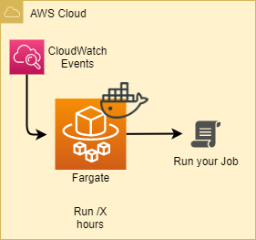

# Schedule Serverless jobs using AWS Fargate

On this sample of Infrastructure as Code, we are using [Terraform](https://www.terraform.io/) to deploy infrastructure to schedule Serverless jobs (bash script) using [AWS Fargate](https://aws.amazon.com/fargate/?nc1=h_ls).

Blog post available [here](https://zoph.me/posts/2019-09-22-serverless-jobs-scheduling-using-aws-fargate/)

## Requirements

- Create an artifacts bucket: `make artifacts` for [Terraform S3 remote state](https://www.terraform.io/docs/backends/index.html)

## Usage

### Deploy

- `git clone https://github.com/z0ph/serverless-jobs-using-fargate.git`
- Prepare your Docker image (using `Dockerfile`)
- Adapt the [`variables.tf`](tf-fargate/variables.tf), and "Config" part in [`Makefile`](Makefile) to your needs
- Run `make build-docker`
- Prepare deployment using `make init`, `make validate`, then `make plan`
- Run `make apply`
- Take a nap, enjoy :cocktail:

### Destroy

- Run `make destroy`

## Schema

